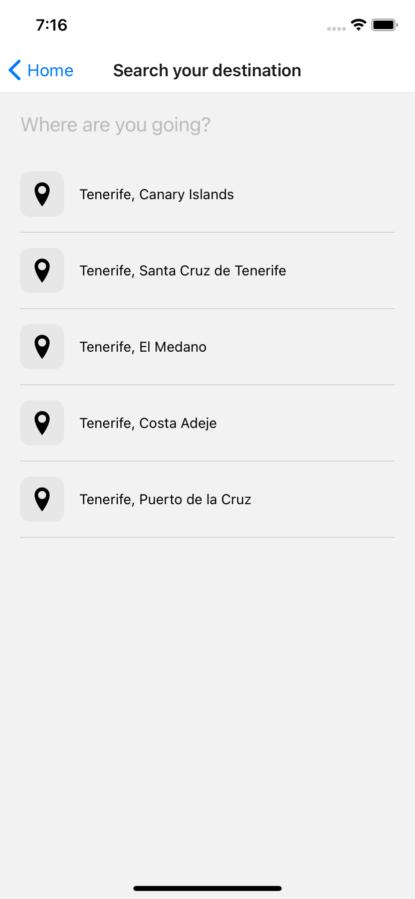

# React Native AIRBNB Clone App UI Only

## Build and run the app

1. Install React Native as described at [https://facebook.github.io/react-native/docs/getting-started.html#content](https://facebook.github.io/react-native/docs/getting-started.html#content)
2. Clone this repository
3. Run `yarn install` , all required components will be installed automatically

    ### iOS
      
    1. Run `pod install` from `react-native-demo/ios` folder

4. It is recommended to run `react-native` command from root project directory.
5. Run your project from XCode (`Cmd+R`) for iOS or use `react-native run-ios`, or use `react-native run-android` to run your project on Android.

## To integrate to AWS AMplify
1. Navigate to [AWS AMplify](https://aws.amazon.com/amplify/)
2. Authentication: Ampify Auth
3. Backend  option: use GraphQL(Recommended), Rest API

## Demo Screenshots

